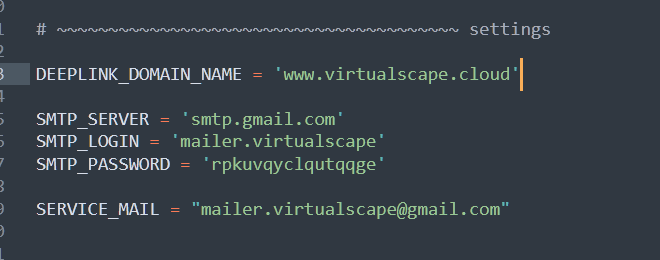
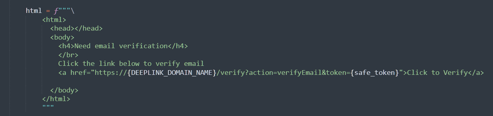
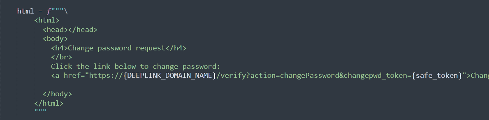
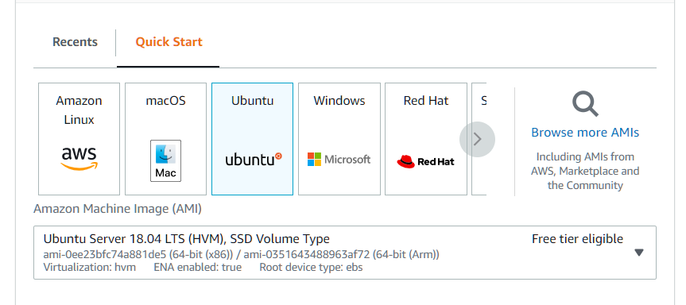

# Firebase Python Admin server

Here is the sources of firebase python admin server. This server will send email confirmation links and manage users of firebase project using FirebaseAdminSDK.


### 1. Server configuration

Copy **firebase_python_admin** git project on your local machine and make some configuration changes.

1.1. During firebase installation steps you have copied **FirebaseAdminSDK** config json file on your desktop. 

Rename it to `firebase_service.json` and replace in current **firebase_python_admin** git reposiitory.

It contains your project credentials for Firebase connection.

1.2 Configure in `main.py` file parameters:

   

​	`DEEPLINK_DOMAIN_NAME` - name of domain that you have access to. This domain will be used for deeplinking URLs.
​    `SMTP_SERVER` - now we are using google to send emails (google standart smtp server)
​    `SMTP_LOGIN` - google email account (with 2FA enabled and service token created)
​    `SMTP_PASSWORD` - google email account service token (third party access token)
​    `SERVICE_MAIL`: sender email 

1.3 Configure email templates:
     in python `main.py` sources you can configure email template:

For verification in `send_confirm_email` function (118 line)     

For reset password in `send_change_password_email` function (191 line)



#### ----!!!--- Don't forget to push firebase_python_admin configuration changes to git ---!!!----


### 2. Create Ec2 Ubuntu-18.04 instance  on amazon.



current server ip is: 

Firebase Python Admin server IP:`18.212.193.101`

I will use it in further details, but your IP  will be different if you create your own machine. Just replace it by your server public IP.

### <u>Next steps should be done on Amazon server machine </u>

### <u>(using ssh connection console)</u>

Am using Putty to connect.

After you connect you need to configure server:

1. Install git

`sudo apt-get install git`

2. Update apt-get links

`sudo apt update`

upgrade system apps

`sudo apt upgrade`

3. Install build tools 
   `sudo apt-get install build-essential`

4. Install pyenv

`curl https://pyenv.run | bash`

(see instructions in console and add changes to files )

add this code to  `~/.profile` (for login shells) and `~/.bashrc` files (for interactive shells)  

am using `vim` tool here

```bash
export PYENV_ROOT="$HOME/.pyenv"
command -v pyenv >/dev/null || export PATH="$PYENV_ROOT/bin:$PATH"
eval "$(pyenv init --path)"
```

Add this code to `~/.bashrc`

```bash
eval "$(pyenv virtualenv-init -)"
```

& Restart console to take effect (and reconnect)

Check that all works, try to update pyenv

```bash
pyenv update
```

5. Install python using pyenv

Because pyenv compiles python from sources we need to install some extra packages:
(also some blender packages included)

```bash
sudo apt-get update; sudo apt-get install --no-install-recommends make build-essential libssl-dev zlib1g-dev libbz2-dev libreadline-dev libsqlite3-dev 

sudo apt-get install --no-install-recommends make libncurses5-dev tk-dev libxml2-dev libxmlsec1-dev libffi-dev liblzma-dev

sudo apt-get install --no-install-recommends make wget curl llvm libxi6 libgconf-2-4 libglu1 xz-utils
```


Install 3.10.4 python version:

```bash
pyenv install 3.10.4
```

6. Set global python version:

   ```
   pyenv global 3.10.4
   ```

7. Update pip

 `python -m pip install --upgrade pip`


8. COPY GIT PROJECT AND CREATE VIRTUAL ENVIRONMENT FOR IT:

   clone git **Firebase Python Admin server** repo into folder:

```
git clone https://github.com/thedogrex/firebase_python_admin /home/ubuntu/firebase_admin
```

navigate to the cloned repository folder by a command:

```
pushd /home/ubuntu/firebase_admin
```

Create virtual env for python modules

```
python -m venv venv
```

Activate virtual env:

```
source venv/bin/activate
```

8. install forked firebase-admin-python library for python:
   (have changed some token generation parameters there)

   ```
   pip install git+https://github.com/thedogrex/firebase-admin-python.git@master
   ```

9.Install flask

```
pip install flask
```


## 3. Server bootstrap (make it available in public web) 

### How it works:

##### [ Http(get,post) ] - [Nginx] - [GUnicorn] - [Python (Flask)]  

Nginx will work like a proxy to connect and process requests from on Flask python application. 
Gunicorn will work like a container for Flask applications (will create Flask instance automatically on each request)

##### Install components:

​	`sudo apt install mc wget rsync zip unzip`

##### Install nginx:

`sudo apt install nginx`

After nginx installation you can open page by server ip address (nginx will return html simple page). 
We will configure nginx to work as proxy server in future.

##### Setup gunicorn

`pip install gunicorn`

##### Setup Firewall

```
sudo apt install ufw
```

Turn on configurations of firewall:

```
sudo ufw allow 'OpenSSH'
```

```
sudo ufw allow 'Nginx Full'
```

And turn on Firewall:

```
sudo ufw enable
```

Need to restart ssh service after:

```
sudo su
systemctl restart ssh
```

reconnect to the console.

#### Create Unit Services for GUnicorn:

Gunicorn service (create this file) using `sudo vim`:

`/etc/systemd/system/gunicorn_my.service`

(`ubuntu` is user name -> type your user name in linux system instead of `ubuntu`)

change to correct user at paths too !!!

```
[Unit]
Description=Autorun gunicorn instance
After=network.target

[Service]
User=ubuntu
Group=www-data
WorkingDirectory=/home/ubuntu/firebase_admin
Environment="PATH=/home/ubuntu/firebase_admin/venv/bin"
ExecStart=/home/ubuntu/firebase_admin/venv/bin/gunicorn --workers 1 --timeout 180 --bind unix:gunicorn.sock -m 007 wsgi:app

[Install]
WantedBy=multi-user.target
```


Note, that line:

```
ExecStart=/home/ubuntu/firebase_admin/venv/bin/gunicorn
```

must be the path of installed gunicorn component inside venv python virtual environment of the projecct


#### Add services to autorun:

`sudo systemctl enable gunicorn_my`

`sudo systemctl enable nginx`


#### Setup nginx proxy:

remove `@default` file from `/etc/nginx/sites-enabled/` folder
am using `sudo mc` navigator  for this task


create nginx conf file at path:
`/etc/nginx/conf.d/firebase_admin.conf`

file content:

*note that "ubuntu" here is your user name (I've created account with a name "ubuntu")

```
server {
	listen 80 default_server;
	listen [::]:80 default_server;
	
	location / {
		include proxy_params;
		proxy_pass http://unix:/home/ubuntu/firebase_admin/gunicorn.sock;
	}
}
```


Now you need to reboot server machine and it should automatically run all services. 
You can open ip address in browser /index page (it should display a message -> "Firebase admin server is running" )


Just open <u>http://18.212.193.101/index</u> to check. You may see text message there.


If you see text message all is working, you can return to the Unity Project repository page and continue.

